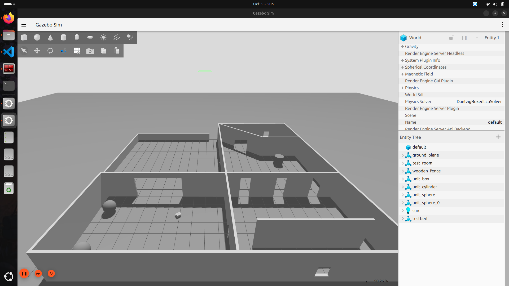
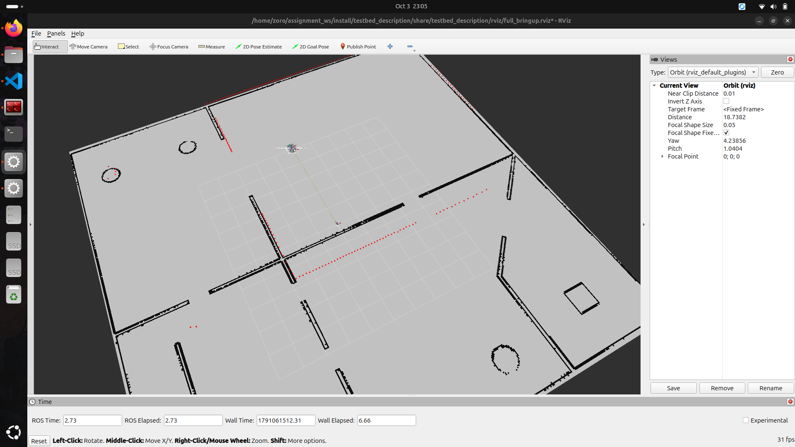
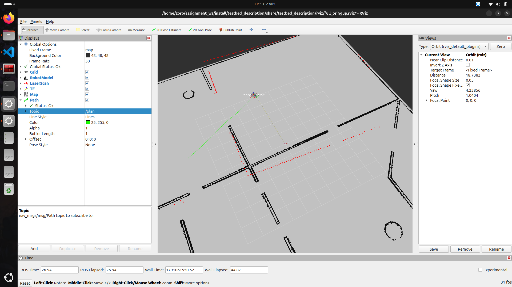
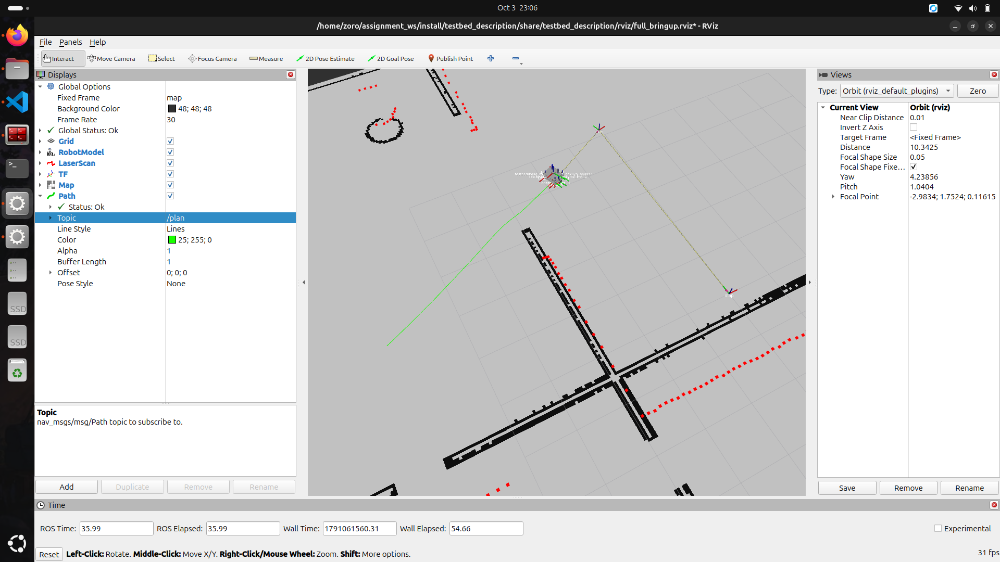

# testbed_navigation

Manual Nav2 navigation workflow for **Testbed-T1.0.0**, built directly from the individual Nav2 plugins (no `nav2_bringup`).

**Platform:** ROS 2 Jazzy · Gazebo Harmonic (`ros_gz`) · Ubuntu 24.04

---

## Package layout

```
testbed_navigation/
├── config/
│   ├── amcl_params.yaml        # AMCL (localization)
│   └── nav2_params.yaml        # planner, controller, BT navigator, behaviors, smoother, collision monitor
├── launch/
│   ├── map_loader.launch.py    # Task 4 – map_server + lifecycle manager
│   ├── localization.launch.py  # Task 5 – includes map_loader, adds AMCL + lifecycle manager
│   └── navigation.launch.py    # Task 6 – includes localization, adds the Nav2 servers + lifecycle manager
├── CMakeLists.txt
└── package.xml
```

The launch files are layered so each stage can be tested on its own:

```
navigation.launch.py
 └── localization.launch.py
      └── map_loader.launch.py
```

Each stage has its own `nav2_lifecycle_manager` (`lifecycle_manager_map_server`, `lifecycle_manager_localization`, `lifecycle_manager_navigation`) with `autostart: true`, so a stage comes up on its own without a manual lifecycle transition and can be restarted independently. Every launch file exposes `use_sim_time`, `map` and its parameter file paths as launch arguments.

---

## How to run

```bash
cd ~/assignment_ws
colcon build --symlink-install
source install/setup.bash

# Terminal 1 – simulation, robot, RViz
ros2 launch testbed_bringup testbed_full_bringup.launch.py

# Terminal 2 – pick ONE, once Gazebo is up
ros2 launch testbed_navigation map_loader.launch.py      # map only
ros2 launch testbed_navigation localization.launch.py    # map + AMCL
ros2 launch testbed_navigation navigation.launch.py      # map + AMCL + Nav2
```

Sending a goal:

- **RViz:** Fixed Frame `map` → **2D Goal Pose** / **Nav2 Goal**, click-drag on the map.
- **Waypoints:** RViz *Navigation 2* panel → *Waypoint / Nav Through Poses Mode* → place poses → *Start Waypoint Following*.
- **CLI:**
  ```bash
  ros2 action send_goal /navigate_to_pose nav2_msgs/action/NavigateToPose \
  "{pose: {header: {frame_id: map}, pose: {position: {x: 2.0, y: 3.0}, orientation: {w: 1.0}}}}" --feedback
  ```

RViz displays used for verification: **Map** on `/map` (Durability: *Transient Local*), **ParticleCloud** on `/particle_cloud` (Reliability: *Best Effort*, added via *By display type → nav2_rviz_plugins*), LaserScan, `/plan`, and the global/local costmaps.

---

## 1. Map loading — `map_loader.launch.py`

- `nav2_map_server/map_server` loads `testbed_bringup/maps/testbed_world.yaml` (405 × 400 px, 0.05 m/px, origin `[-10.2, -9.94]`).
- The map is published once on `/map` with *transient local* durability; late subscribers (AMCL, global costmap, RViz) still receive it.

## 2. Localization — `localization.launch.py` + `amcl_params.yaml`

| Parameter group | Choice | Reason |
|---|---|---|
| Frames | `map` → `odom` → `base_footprint` | `odom → base_footprint` comes from the Gazebo DiffDrive system; AMCL provides `map → odom` |
| Motion model | `DifferentialMotionModel`, `alpha1–5: 0.2` | diff-drive robot; moderate odometry noise in simulation |
| Sensor model | `likelihood_field`, `max_beams: 60` | robust and cheap; 60 of the 300 lidar beams is enough for a 20 × 20 m map |
| Laser range | `laser_min_range: 0.10`, `laser_max_range: 10.0` | matches the simulated lidar |
| Particles | 500 – 2000 | good accuracy without high CPU load |
| Update thresholds | `update_min_d: 0.25`, `update_min_a: 0.2` | filter updates only after meaningful motion |
| Initial pose | `set_initial_pose: true`, `(0.0, 5.0, 0.0)` | same as the spawn pose in `spawn_testbed.launch.py`, so the robot is localized at start-up without a manual *2D Pose Estimate* |

## 3. Navigation — `navigation.launch.py` + `nav2_params.yaml`

| Component | Plugin | Notes |
|---|---|---|
| BT Navigator | `NavigateToPoseNavigator`, `NavigateThroughPosesNavigator` | default Nav2 behavior trees; listens on `/goal_pose` for RViz goals |
| Global planner | `nav2_navfn_planner/NavfnPlanner` (Dijkstra) | `tolerance: 0.3`, `allow_unknown: true` |
| Controller | `RegulatedPurePursuitController` | well suited to a small diff-drive robot; `desired_linear_vel: 0.2`, rotate-to-heading on, collision detection on |
| Progress / goal checkers | `SimpleProgressChecker`, `SimpleGoalChecker` | `xy_goal_tolerance: 0.15`, `yaw_goal_tolerance: 0.25` |
| Local costmap | rolling 3 × 3 m in `odom` | obstacle layer (lidar) + inflation |
| Global costmap | `map` frame | static layer (map) + obstacle layer + inflation |
| Footprint | `[[0.21, 0.19], [0.21, -0.19], [-0.09, -0.19], [-0.09, 0.19]]` | approximates the chassis around `base_footprint` |
| Behaviors | spin, backup, drive_on_heading, wait | recovery behaviors used by the default BT |
| Waypoint follower | `WaitAtWaypoint` (200 ms) | follows multi-waypoint missions |
| Velocity smoother | open-loop, max `[0.3, 0, 1.0]` | limits acceleration so motion is smooth |
| Collision monitor | polygon `StopZone` around the footprint | stops the robot if a lidar point enters the zone, independent of the planner |

**cmd_vel chain:**

```
controller_server / behavior_server ──cmd_vel_nav──▶ velocity_smoother ──cmd_vel_smoothed──▶ collision_monitor ──cmd_vel──▶ Gazebo DiffDrive
```

---

## Challenges and how they were solved

1. **Starter code targeted Gazebo Classic, but ROS 2 Jazzy ships with Gazebo Harmonic.** I ported the robot and worlds to `ros_gz`: the DiffDrive, JointStatePublisher and IMU systems, a `gpu_lidar` sensor, `ros_gz_sim create` for spawning, and a `ros_gz_bridge` for `/clock`, `/cmd_vel`, `/odom`, `/tf`, `/imu`, `/scan` and `/joint_states`. I also added the required system plugins (Physics, Sensors, SceneBroadcaster, UserCommands, Imu) to the worlds.
2. **Mismatch between the lidar TF frame and the URDF link names.** Gazebo Harmonic stamps sensor data with a scoped frame (`testbed/base_footprint/head_hokuyo_sensor`) that `robot_state_publisher` does not know, so RViz and AMCL dropped every scan. A zero-offset `static_transform_publisher` now maps this frame to `lidar_link_1` (and does the same for the IMU).
3. **Map not showing in RViz.** The map is published once with *transient local* durability, so the RViz Map display has to subscribe with *Transient Local* durability and use Fixed Frame `map`.
4. **Lidar range too short for localization.** With the original 1.5 m range, the robot often saw nothing in open areas (all readings `inf`), and AMCL fell back on odometry alone. I raised the sensor range to 10 m and set `laser_max_range` to match.
5. **Simulated time.** `robot_state_publisher` was not using `use_sim_time`, so its TF timestamps did not match the Gazebo clock. All nodes now run with `use_sim_time: true`.

The bugs found in the starter code are listed in [`../bugs_and_fixes.txt`](../bugs_and_fixes.txt).

---

## Results

**Simulation world (Gazebo Harmonic)**



**Localization:** the robot is localized on `testbed_world.pgm`. The laser scan (red) lines up with the map walls.



**Navigation:** a goal sent with *2D Goal Pose*. The global plan (`/plan`, green) goes around the walls, and the robot follows it.

| Plan computed | Robot following the plan |
|---|---|
|  |  |

**Demo video:** [media/demo.webm](media/demo.webm)
